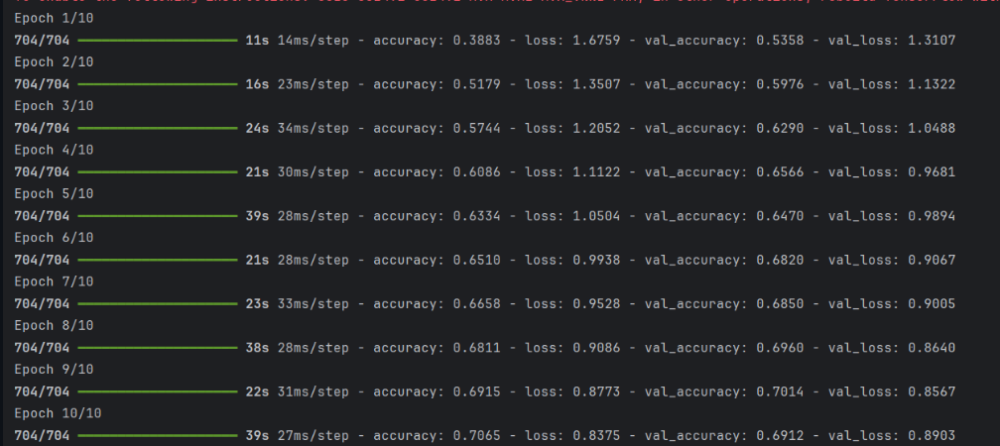

# Лабораторная работа №6. Сверточные нейронные сети.

## Общее задание

1. С использованием библиотеки **Keras** загрузить обучающую выборку, создать модель сверточной сети, обучить её на обучающей выборке и сохранить модель в файл.
2. Написать дополнительную программу, которая загружает модель из файла и предоставляет возможность загрузить изображение для классификации.

## Набор данных

В качестве набора данных использован **Dog and Cat Classification Dataset** с платформы Kaggle.  
Датасет содержит изображения собак и кошек различного разрешения, предназначенные для бинарной классификации.

## Структура проекта

- `lab6.py` — основной скрипт для загрузки данных, создания, обучения и сохранения модели.
- `lab6_num2.py` — скрипт для загрузки сохранённой модели и тестирования на отдельных изображениях.

## Обучение 

Файл: `lab6.py`

### Загрузка датасета

Датасет загружается через `kagglehub`:

```
import kagglehub
path = kagglehub.dataset_download("bhavikjikadara/dog-and-cat-classification-dataset")
```

## Загрузка и предобработка изображений

Изображения загружаются, приводятся к размеру 32×32 пикселя и нормализуются:

```
def load_images(base_path, img_size=(32, 32), max_per_class=2000):

    return np.array(images), np.array(labels)

train_data, train_labels = load_images(path)
train_data = train_data.astype('float32') / 255.0
train_labels = to_categorical(train_labels, num_classes=2)
```

## Архитектура модели

```
model = Sequential([
    Conv2D(32, (3, 3), activation='relu', input_shape=(32, 32, 3)),
    MaxPooling2D((2, 2)),
    Conv2D(64, (3, 3), activation='relu'),
    MaxPooling2D((2, 2)),
    Flatten(),
    Dense(128, activation='relu'),
    Dropout(0.5),
    Dense(2, activation='softmax')
])
```

## Обучение модели 

```
model.compile(loss='categorical_crossentropy', optimizer='adam', metrics=['accuracy'])
model.fit(train_data, train_labels, epochs=10, batch_size=64, validation_split=0.1)
```


## Сохранение модели

```
model.save('cnn_dog_cat_model.h5')
```

## Функция предобработки изображения

```
def preprocess_image(image_path, img_size=(32, 32)):
    img = Image.open(image_path).convert('RGB')
    img = img.resize(img_size)
    img_array = np.array(img).astype('float32') / 255.0
    img_array = np.expand_dims(img_array, axis=0)
    return img_array
```

## Тестирование


